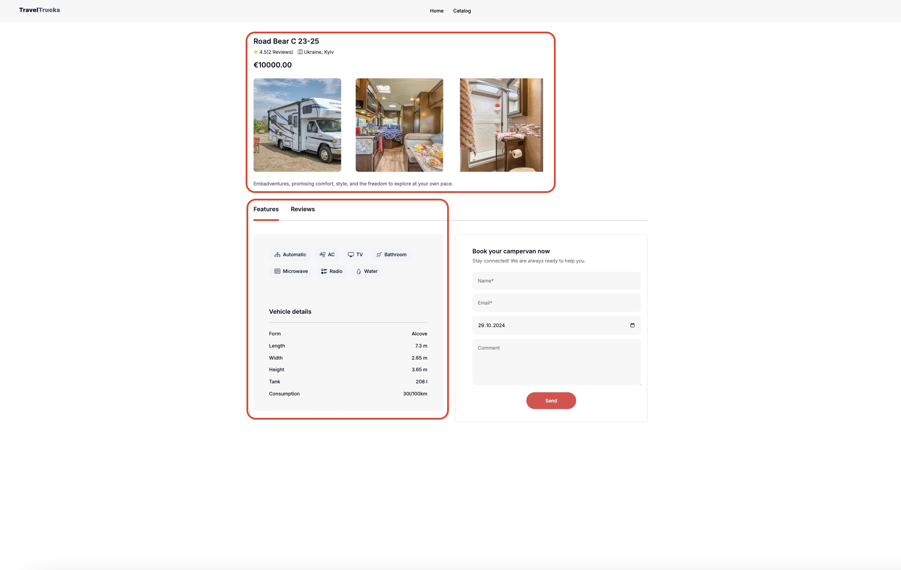

# TravelTrucks

**TravelTrucks** is a web platform for booking campervans, making it easy to plan your next road trip adventure. From exploring rugged landscapes to city breaks, find the perfect campervan and hit the road!

## Table of Contents
- [Features](#features)
- [Installation](#installation)

---

## Features

- **Browse Campervans** – View available campervans with images, descriptions, and amenities.
  

- **Filter Campervans** – Narrow down options by applying various filters.
  

- **Location Suggestions** – User-friendly interface for selecting your location.
  

- **Campervan Details** – View each campervan's detailed information.
  

- **Rating System** – Browse reviews from other users about your chosen campervan.
  

- **Booking System** – Book a campervan for your selected dates with real-time availability.
  

- **User-Friendly Calendar** – Convenient date selection for your booking.
  

- **Booking Data Validation** – Prevents submission of invalid data.
  

## Installation

### Prerequisites
- [Node.js](https://nodejs.org/) and [npm](https://www.npmjs.com/)

### Installation
1. **Clone the repository**:
   ```bash
   git clone https://github.com/DelrikCh/TravelTrucks.git
   cd TravelTrucks
2. **Install dependencies**:
    ```bash
    npm install
3. **Run the development server (or deploy the site to your preferred platform)**:
    ```bash
    npm run dev

<hr>

With **TravelTrucks**, booking your next adventure on wheels is just a click away!
